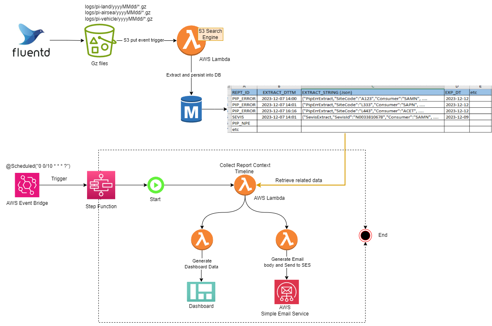

# aws batch job for S3 log error report

This architectural design is a batch process designed to extract error messages from the application log files stored in an S3 bucket and subsequently send EMails to the production support team. It utilizes the project [S3 log search](https://github.com/github4daniel/s3logSearch) as search engine. The <B> <I>S3 log search</B></I> is web application doing free text search for the gz file stored in S3 bucket.
  

### 1. Business Requirements

FluntD collects application logs, archives them, and periodically transfers the archived file to an S3 bucket when the buffer is full. A backend process is required to handle the log information, categorize and generate statistics, and then send Emails to the production support team

### 2. Design

The defining characteristics of the application is its on-demand nature, eliminating the necessity for continuous 24/7 operation like traditional service or server. To best align with this requirement, the optimal solution is to leverage AWS Serverless architect for the application. The following architecture diagram is what I propose. 

 <li>Upon FluentD placing a log file into the S3 bucket, the S3 system generate a ObjectPutEvent. The event serves as a trigger for the Lambda function. The Lambda function (S3 Search Engine in diagram) is responsible for extracting pertinent log information from file and subsequently saving into the database.  This Lambda function is similar to S3 log search we implemented.
 </li> 
 <li>
 AWS EventBridge acts as a time scheduler, trigger a AWS Step Function. The entry Lambda function collects event context, such as the type of error, time lines for log entries and search the error message in log files.
</li> 
<li>
The first branch of Lambda is dedicated to aggregating and processing error data for email content generation, and utilize AWS Simple Email Service (SES) to send email to recipients.
The second branch of  Lambda is responsible for aggregating and processing error data as well, but it focus on generating data for the Dashboard.
</li> 

*Figure 1: Architecture Diagram batch Job for S3 log error extraction

### 3. Selection of AWS services

Team has propose other AWS service technologies for evaluation:

<li><B>AWS Glue + Athena: </B>
AWS Glue serves as an ETL (Extract, Transform, Load) tool, dedicated to the preparation and transformation of data. It automatically discovers, catalogs, and transforms data from various sources. AWS Glue use Crawlers for discovering metadata from diverse data sources. Athena functions as a query tool, enabling the selection of subsets of the prepared and transformed data stored in Amazon S3. Together, AWS Glue and Athena contribute to a comprehensive data processing and querying workflow.

<li><B>AWS Step Function: </B>
AWS step function is a fully managed AWS web service that enables you to coordinate and orchestrate multiple service into Serverless workflow. It supports parallel processing.

<li><B>AWS Batch: </B>
AWS batch is a fully managed AWS web service that allow you to run batching computing workloads on the AWS cloud.  You can provision EC2 and docker or Serverless Fargate (without provision EC2 instance). The AWS batch is suitable for long running process.  

### 4. AWS Service Provision
Use Terraform as AWS provision tool.
